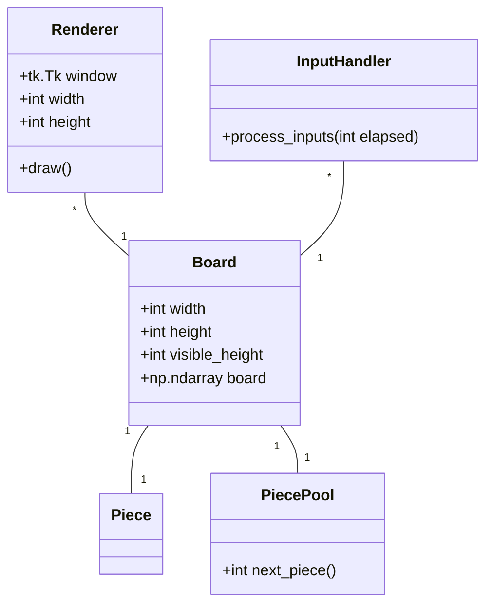
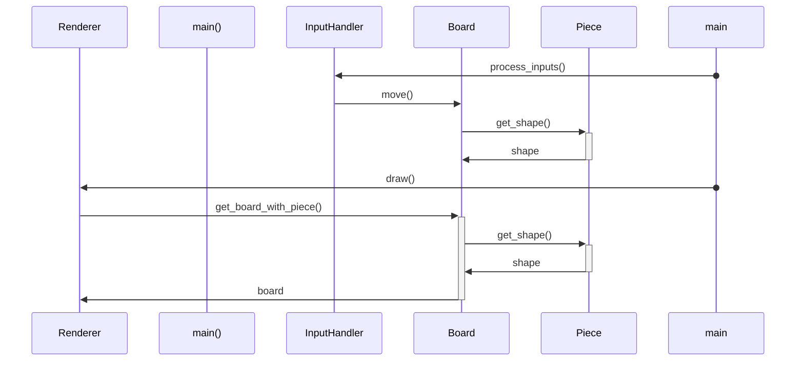

# Arkkitehtuuri

```mermaid
classDiagram

    class Board {
        +int width
        +int height
        +int visible_height
        +np.ndarray board
    }
    class PiecePool {
        +int next_piece()
    }
    class Piece
    class Renderer {
        +tk.Tk window
        +int width
        +int height
        +draw()
    }
    class InputHandler {
        +process_inputs(int elapsed)
    }

    Board "1" -- "1" Piece
    Board "1" -- "1" PiecePool
    Renderer "*" -- "1" Board
    InputHandler "*" -- "1" Board

```

Sekvenssikaavio esimerkki palan liikuttamisesta:

```mermaid
sequenceDiagram

participant Renderer
participant main()
participant InputHandler
participant Board
participant Piece

main() ->> InputHandler: process_inputs()
InputHandler ->> Board: move()
Board ->> +Piece: get_shape()
Piece ->> -Board: shape

main() ->> Renderer: draw()
Renderer ->> +Board: get_board_with_piece()
Board ->> +Piece: get_shape()
Piece ->> -Board: shape
Board ->> -Renderer: board

```