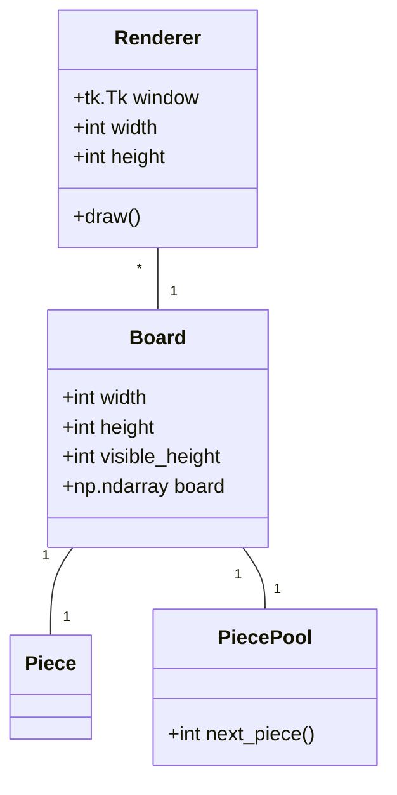

# Arkkitehtuuri

```mermaid
classDiagram

    class Board {
        +int width
        +int height
        +int visible_height
        +np.ndarray board
    }
    class PiecePool {
        +int next_piece()
    }
    class Piece
    class Renderer {
        +tk.Tk window
        +int width
        +int height
        +draw()
    }

    Board "1" -- "1" Piece
    Board "1" -- "1" PiecePool
    Renderer "*" -- "1" Board

```