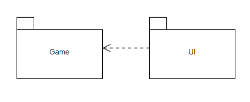
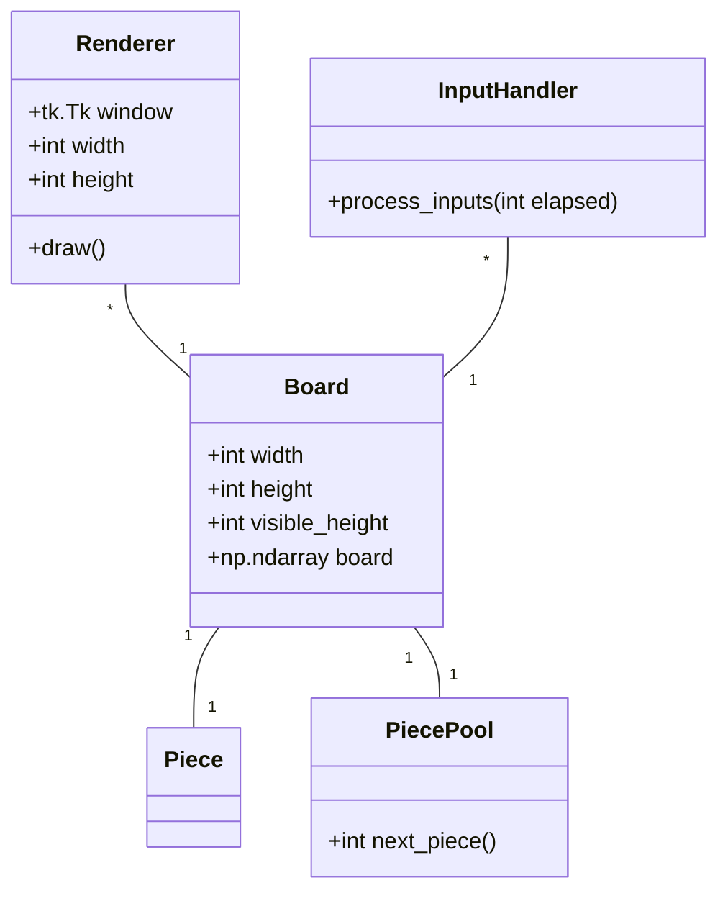
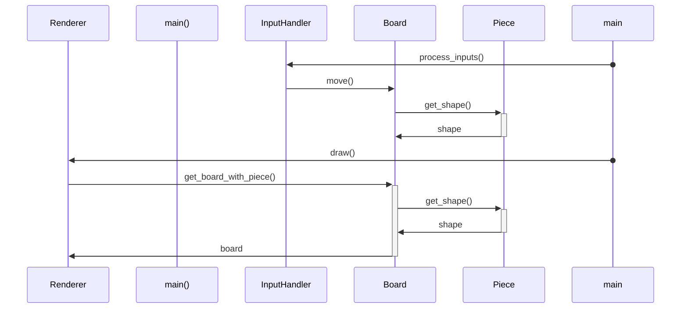

# Arkkitehtuurikuvaus

## Rakenne

Pakkaus *UI* sisältää käyttöliittymästä ja kontrolleista vastaavan ja *Game* pelilogiikasta vastaavan koodin.

## Sovelluslogiikka

*Inputhandler* luokka vastaa käyttäjän painalluksien lukemisesta ja kutsuu luokan *Board* metodeja muuttaakseen peliä. Luokkaa *Renderer* kutsutaan *Inputhandler*-luokan jälkeen jolloin se pyytää luokalta *Board* esityksen pelilaudalta piirrettäväksi.

*Board*-luokka käyttää luokkaa *PiecePool* tulevien palojen arpomiseen, sekä luokkaa *Piece*, joka pitää tietoa palan sijainnista ja asennosta.

## Toiminnaillsuudet

Sekvenssikaavio esimerkki palan liikuttamisesta:
