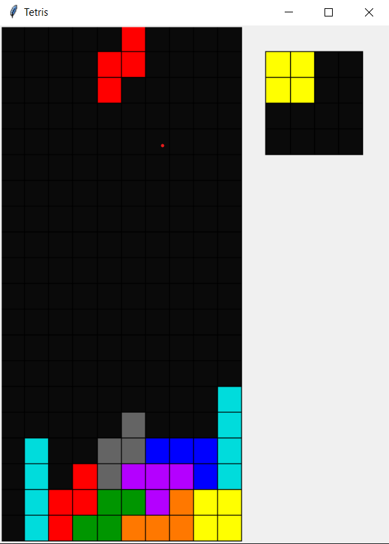

# Käyttöohje

## Asetukset

Asetukset sijaitsevat tiedostossa `config\settings.ini`.
Eri asetusten selitykset [täällä](https://github.com/ossi-hy/ot-harjoitustyo/blob/master/config/README.md).

## Käynnistys

Asenna riippuvuudet
```bash
$ poetry install [--no-dev]
```

Käynnistä sovellus
```bash
$ poetry run invoke start
```

## Aloitusruutu

Aloitusruudusta voi aloittaa pelin, tai poistua pelistä. Asetusten muttaminen käyttöliittymän kautta on vielä työn alla.

## Peliruutu



Peliruudussa peliä ohjataan asetuksissa määritellyillä näppäimillä. Takaisin aloitusruutun pääsee painamalla 'esc'. Tällä hetkellä pelattava pala näkyy ylälaidassa, ja sitä voi liikutella ja pyörittää. 

Kun pala on haluamassa kohdassa, sen voi tiputtaa painamalla [drop]. Jos varjopala on päällä, näkyy tuleva tiputuskohta harmaana palana peliruudun alaosassa.

Oikealla ylhäällä erillisessä laatikossa näkyvä pala on niin sanottu *hold*-pala. Kun painat [hold], niin tällä hetkellä pelattava pala siirtyy talteen, ja tallessa ollut pala siirtyy pelattavaksi. Jos tallessa ei vielä ole palaa, niin pelattavaksi tulee uusi pala. Tämän vaihdon voi tehdä vain kerran tiputusten välissä.

Kun pelilaudalle saa täyden rivin, se katoaa, ja jäljellä olevat palat tippuvat alaspäin. Pelin tarkoituksena on täyttää mahdollisimman monta riviä, mahdollisimman nopeasti.

Pelin voi aloittaa nopeasti alusta painamalla [reset].