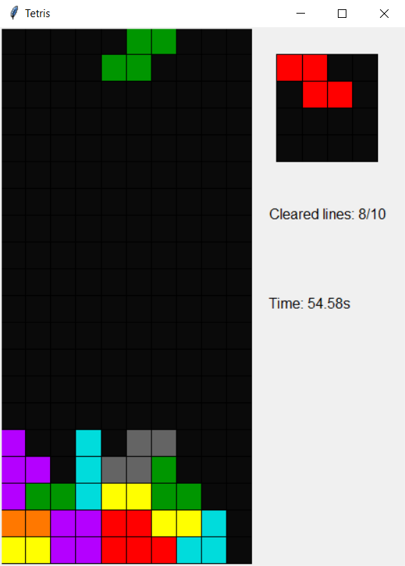

# Käyttöohje

## Käynnistys

Asenna riippuvuudet
```bash
$ poetry install [--no-dev]
```

Käynnistä sovellus
```bash
$ poetry run invoke start
```

## Aloitusruutu

Aloitusruudusta voi aloittaa pelin, mennä asetuksiin tai poistua pelistä. Aloitusruutua navigoidaan klikkaamalla hiirellä. Poistua voi myös painamalla `esc` (toimii kaikkialla pelissä).

## Peliruutu



Peliruudussa peliä ohjataan asetuksissa määritellyillä näppäimillä. Takaisin aloitusruutun pääsee painamalla `esc`. Tällä hetkellä pelattava pala näkyy ylälaidassa, ja sitä voi liikutella ja pyörittää. 

Kun pala on haluamassa kohdassa, sen voi tiputtaa painamalla [drop]. Jos varjopala on päällä, näkyy tuleva tiputuskohta harmaana palana peliruudun alaosassa.

Oikealla ylhäällä erillisessä laatikossa näkyvä pala on niin sanottu *hold*-pala. Kun painat [hold], niin tällä hetkellä pelattava pala siirtyy talteen, ja tallessa ollut pala siirtyy pelattavaksi. Jos tallessa ei vielä ole palaa, niin pelattavaksi tulee uusi pala. Tämän vaihdon voi tehdä vain kerran tiputusten välissä.

Kun pelilaudalle saa täyden rivin, se katoaa, ja jäljellä olevat palat tippuvat alaspäin. Pelin tarkoituksena on täyttää 20 riviä mahdollisimman nopeasti. Eli toisin kuin klassisessa tetriksessä, haasteena ei ole selviytyminen, vaan nopeus.

Pelin voi aloittaa nopeasti alusta painamalla [reset].

## Asetukset


Asetuksista voit vaihtaa pelissä käytettäviä kontrolleja. Kun haluat vaihtaa tiettyyn tapahtumaan käytettävän näppäimen, klikkaa hiirellä oikeassa listassa olevaa näppäintä. Tämän jälkeen painamalla haluttua uutta näppäintä peli vaihtaa ja tallentaa uuden näppäimen. Tetrominojen lopullisen tippumiskohdan näyttävän "varjon" voi poistaa tai lisätä painamalla tekstin "shadow" vieressä olevaa tekstiä `true`. Takaisin aloitusruutuun pääse painamalla `esc`,

### Lisäasetukset

> ⚠ Huom! Tämän tiedoston poistaminen tai väärä formatointi saattaa aiheuttaa ohjelman kaatumisen. Tässä tapauksessa on helpointa kopioida alkuperäinen asetustiedosto.

Lisäasetukset sijaitsevat tiedostossa `config\settings.ini`.
Eri asetusten selitykset [täällä](https://github.com/ossi-hy/ot-harjoitustyo/blob/master/config/README.md).