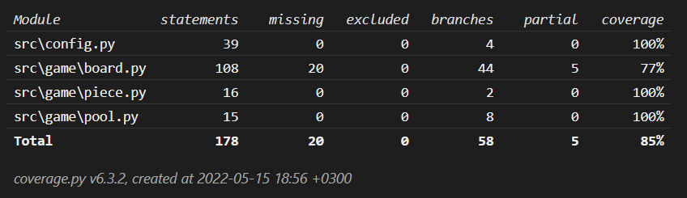

# Testausdokumentti

## Yksikkö- ja integraatiotestaus

### Sovelluslogiikka

Pelin logiikasta huolehtivia luokkia `Board`, `Piece` ja `Pool`  testataan jokaista omassa testiluokassaan. Asetusten lukemisesta ja kirjoituksesta huolehtivaa moduulia `config.py` testataan luokassa `TestConfig`, joka uudelleenlataa moduulin tarkistutsten välissä.

### Testikattavuus

Koodin testien haarautumakattavuus on noin 85%.

## Järjestelmätestaus

Järjestelmätestaus on tehty manuaalisesti.

### Asennus

Sovellusta on testattu sekä Windows, että Linux käyttöjärjestelmällä.

## Puutteet

- Sovellus ei toimi, jos `settings.ini` puuttuu.