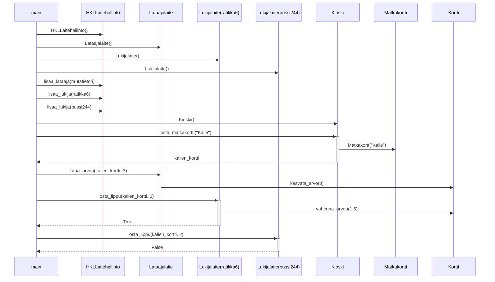

# Sekvenssikaavio

```mermaid
sequenceDiagram

participant main
participant HKLLaitehallinto
participant Lataajalaite
participant Lukijalaite(ratikka6)
participant Lukijalaite(bussi244)
participant Kioski
participant Matkakortti

main ->> HKLLaitehallinto: HKLLaitehallinto()
main ->> Lataajalaite: Lataajalaite()
main ->> Lukijalaite(ratikka6): Lukijalaite()
main ->> Lukijalaite(bussi244): Lukijalaite()

main ->> HKLLaitehallinto: lisaa_lataaja(rautatietori)
main ->> HKLLaitehallinto: lisaa_lukija(ratikka6)
main ->> HKLLaitehallinto: lisaa_lukija(bussi244)

main ->> Kioski: Kioski()
main ->> +Kioski: osta_matkakortti("Kalle")
Kioski ->> Matkakortti:Matkakortt("Kalle")
Kioski -->> -main: kallen_kortti

main ->> Lataajalaite: lataa_arvoa(kallen_kortti, 3)
Lataajalaite ->> Kortti: kasvata_arvo(3)

main ->> +Lukijalaite(ratikka6): osta_lippu(kallen_kortti, 0)
Lukijalaite(ratikka6) ->> Kortti: vahenna_arvoa(1.5)
Lukijalaite(ratikka6) -->> -main: True

main ->> +Lukijalaite(bussi244): osta_lippu(kallen_kortti, 2)
Lukijalaite(bussi244) -->> -main: False
```