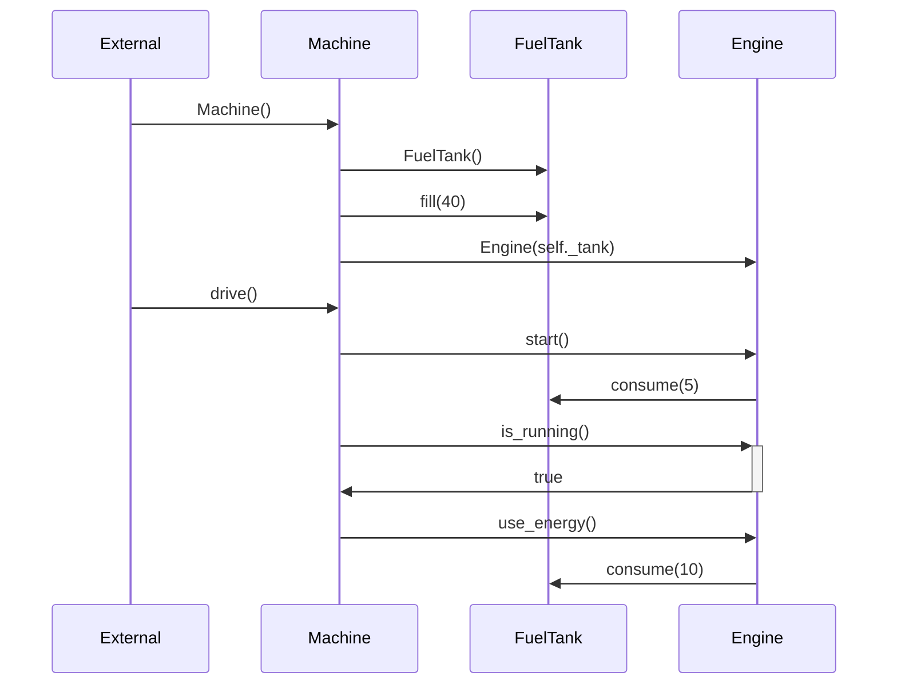

# Sekvenssikaavio

```mermaid
sequenceDiagram
participant External
participant Machine
participant FuelTank
participant Engine

External ->> Machine: Machine()
Machine ->> FuelTank: FuelTank()
Machine ->> FuelTank: fill(40)
Machine ->> Engine: Engine(self._tank)

External ->> Machine: drive()
Machine ->> Engine: start()
Engine ->> FuelTank: consume(5)
Machine ->> +Engine: is_running()
Engine ->> -Machine: true
Machine ->> Engine: use_energy()
Engine ->> FuelTank: consume(10)
```