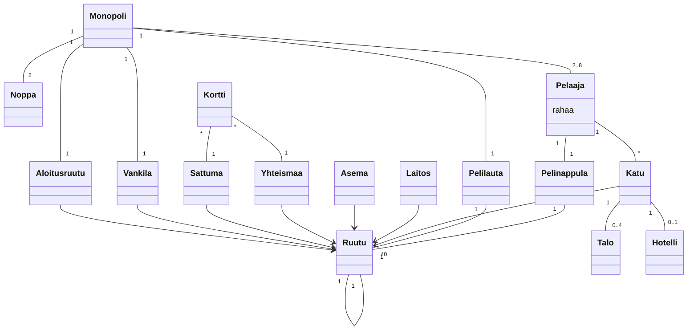

# Monopolin luokkakaavio

```mermaid
classDiagram
    class Monopoli
    class Pelilauta
    class Noppa
    class Pelaaja {
        rahaa
    }
    class Pelinappula
    class Ruutu
    class Kortti

    class Aloitusruutu
    class Vankila
    class Sattuma
    class Yhteismaa
    class Asema
    class Laitos
    class Katu

    class Talo
    class Hotelli

    Pelaaja "1" -- "*" Katu
    Katu "1" -- "0..4" Talo
    Katu "1" -- "0..1" Hotelli

    Aloitusruutu --> Ruutu
    Vankila --> Ruutu
    Sattuma --> Ruutu
    Yhteismaa --> Ruutu
    Asema --> Ruutu
    Laitos --> Ruutu
    Katu --> Ruutu

    Kortti "*" -- "1" Sattuma
    Kortti "*" -- "1" Yhteismaa

    Monopoli "1" -- "1" Aloitusruutu
    Monopoli "1" -- "1" Vankila

    Monopoli "1" -- "1" Pelilauta
    Pelilauta "1" -- "40" Ruutu
    Ruutu "1" -- "1" Ruutu
    Monopoli "1" -- "2" Noppa
    Monopoli "1" -- "2..8" Pelaaja
    Pelaaja "1" -- "1" Pelinappula
    Pelinappula "1" -- "1" Ruutu

```